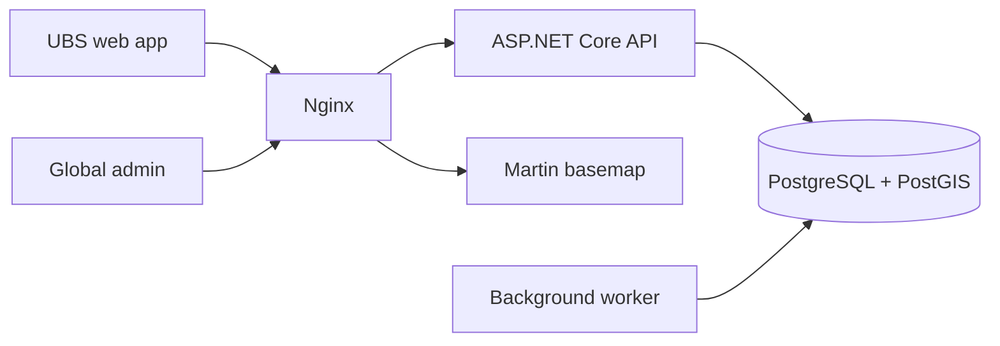

# Architecture overview

STU is a modular monolith with two browser applications and one protected API. Domain and application layers are independent of persistence and HTTP concerns.



## Dependency direction

```text
STU.Api ───────┐
               ├──> STU.Application ──> STU.Domain
STU.Worker ────┤
               └──> STU.Infrastructure ──> STU.Application + STU.Domain
```

## Planned modules

- Health units and organizational structure;
- Identity, roles, permissions, and transfers;
- Neighborhoods, microregions, and territorial versions;
- Properties, identifiers, tags, and assignments;
- Structured visits, coverage, and operational indicators;
- Imports, exports, notifications, audit, and backups.

Private geographic layers will be served by authenticated API endpoints. Martin is reserved for approved local basemap archives.
